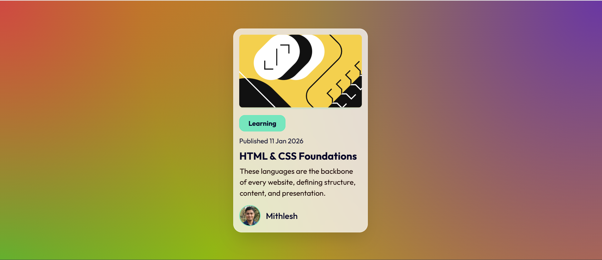

# 3D Glassmorphism Blog Preview Card

An interactive Blog Preview Card component featuring a modern Glassmorphism UI and a dynamic 3D tilt effect driven by mouse movement. This project demonstrates advanced CSS styling and DOM manipulation using Vanilla JavaScript.



## ✨ Features

* **Interactive 3D Tilt:** The card rotates along the X and Y axes based on the cursor position within the viewport, creating a depth effect.
* **Glassmorphism UI:** Utilizes `backdrop-filter: blur()` and semi-transparent backgrounds to create a frosted glass look.
* **CSS Variables:** Consistent color theming using CSS Custom Properties (`:root`).
* **3D Depth Elements:** Child elements (like the image and text) translate along the Z-axis (`translateZ`) to pop out from the card during rotation.
* **Responsive Design:** Fluid layout adapting to screen sizes.

## 🛠️ Technologies Used

* **HTML5:** Semantic structure.
* **CSS3:** Flexbox, CSS Variables, 3D Transforms (`perspective`, `rotateX`, `rotateY`), and Gradient backgrounds.
* **JavaScript (ES6):** Event listeners (`mousemove`, `mouseleave`) for calculating rotation logic.
* **Fonts:** [Outfit](https://fonts.google.com/specimen/Outfit) via Google Fonts.

## 🧠 Code Highlights

### The 3D Tilt Logic (JavaScript)
The script calculates the center of the screen and determines how far the mouse is from that center. It divides the result by 20 to soften the sensitivity of the rotation.

```javascript
container.addEventListener('mousemove', (e) => {
    // Calculate rotation based on cursor position relative to center
    const x_Axis = (window.innerWidth / 2 - e.pageX) / 20;
    const y_Axis = (window.innerHeight / 2 - e.pageY) / 20;

    // Apply the rotation
    card.style.transform = `rotateY(${x_Axis}deg) rotateX(${y_Axis}deg)`;
});
```
The Glassmorphism (CSS)
The "frosted glass" effect is achieved using a combination of semi-transparent background colors and the backdrop filter.

```css
#card {
  background-color: var(--cd-clr); /* rgba(255, 255, 255, 0.75) */
  backdrop-filter: blur(16px);     /* The blur magic */
  -webkit-backdrop-filter: blur(16px);
  border: 1px solid rgba(255, 255, 255, 0.8);
}
```