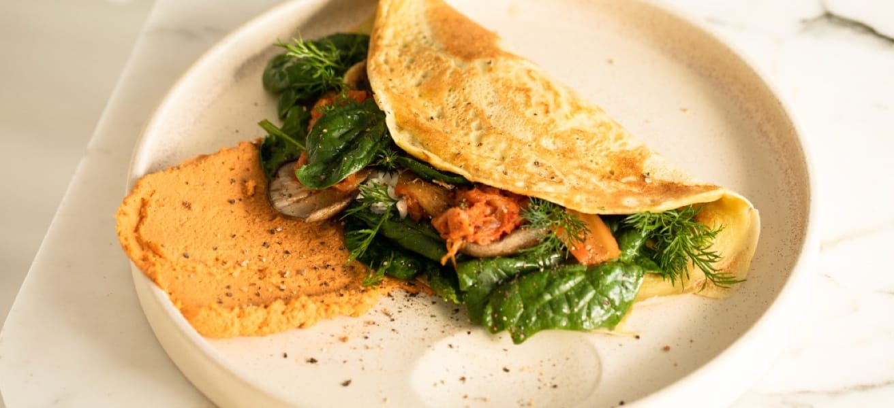

# Simple Omelette Recipe Page 🍳

A responsive, accessible, and pixel-perfect recipe card built with semantic HTML5 and modern CSS3.

## 📖 About the Project

This project is a responsive recipe page that displays cooking times, ingredients, instructions, and a nutrition table. The goal was to build a layout that looks beautiful on both desktop and mobile devices while ensuring the code is robust and accessible.

### Key Features
- **Responsive Design:** "Edge-to-edge" image layout on mobile devices and a centered card layout on desktop.
- **Accessibility (a11y):** Uses Semantic HTML (`<section>`, `<h1>`-`<h2>` hierarchy) and ARIA roles (`role="table"`) to ensure screen readers can navigate the content correctly.
- **Modern CSS Layouts:** Utilizes **CSS Grid** for the nutrition table and **Flexbox** for page alignment.
- **Robust Typography:** Integrated Google Fonts (Young Serif & Outfit) with variable font-weight handling.

## 🛠️ Technologies Used

- **HTML5:** Semantic markup and ARIA roles.
- **CSS3:** Custom Properties (Variables), CSS Grid, Flexbox, and Media Queries.
- **Google Fonts:** For custom typography.

🧠 What I Learned
This project helped me master several key frontend concepts:

CSS Grid vs. Magic Numbers: I initially used word-spacing to align the nutrition table, but learned that CSS Grid (grid-template-columns: 1fr 1fr) is a much more robust solution for tabular layout.

Accessibility: I learned that while 
s are useful, they have no semantic meaning. I used role="table", role="row", and role="cell" to ensure the nutrition grid is accessible to blind users.

Mobile-First Strategy: I implemented a media query (max-width: 440px) to handle the padding differences between mobile (full-width image) and desktop (framed card).

DRY (Don't Repeat Yourself): Created utility classes like .section-divider to reuse border styles instead of repeating code.