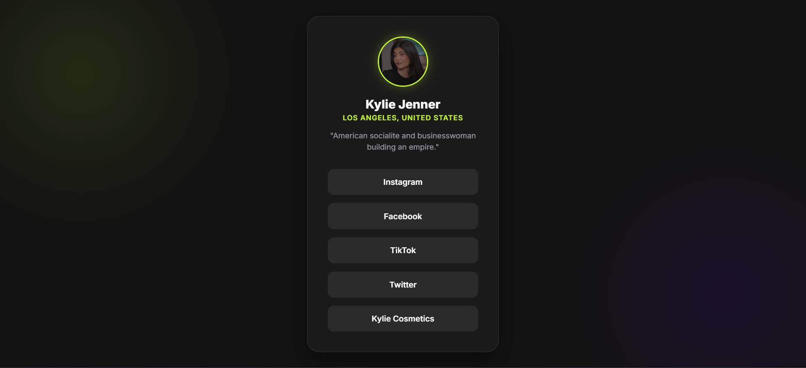

# Social Links Profile 🚀

A modern, "High Level" social links profile page featuring a glassmorphism UI design, responsive layout, and interactive hover effects. This project serves as a stylish "Link in Bio" landing page to aggregate social media profiles.

## ✨ Features

- **Glassmorphism UI:** Trendy frosted glass effect using `backdrop-filter`.
- **Responsive Design:** Fluid layout that adapts perfectly to mobile, tablet, and desktop screens.
- **Interactive Animations:** Smooth `transform` and `box-shadow` transitions on hover.
- **Semantic HTML5:** Built with accessibility and SEO best practices in mind (using `<main>`, `<ul>`, `<li>`).
- **CSS Variables:** Easy-to-customize color themes and fonts.

## 🛠️ Technologies Used

- **HTML5:** For structure and semantics.
- **CSS3:** For styling, Flexbox layout, and animations.
- **Google Fonts:** Using 'Inter' for clean, modern typography.

## My Learnings during the Project

1. A modal is a pop-up window that appears over the current page and must be interacted with or closed before you can continue using the rest of the site/app. Think of it like a temporary, focused task window, such as for logging in or confirming an action.

2. A splash screen is an introductory screen that appears while a website or application is loading. It's usually a full-screen image, logo, or animation designed to occupy your attention during the wait time, after which it disappears automatically to reveal the main content.

3. In HTML context, CDN is an acronym for Content Delivery Network (or Content Distribution Network). 